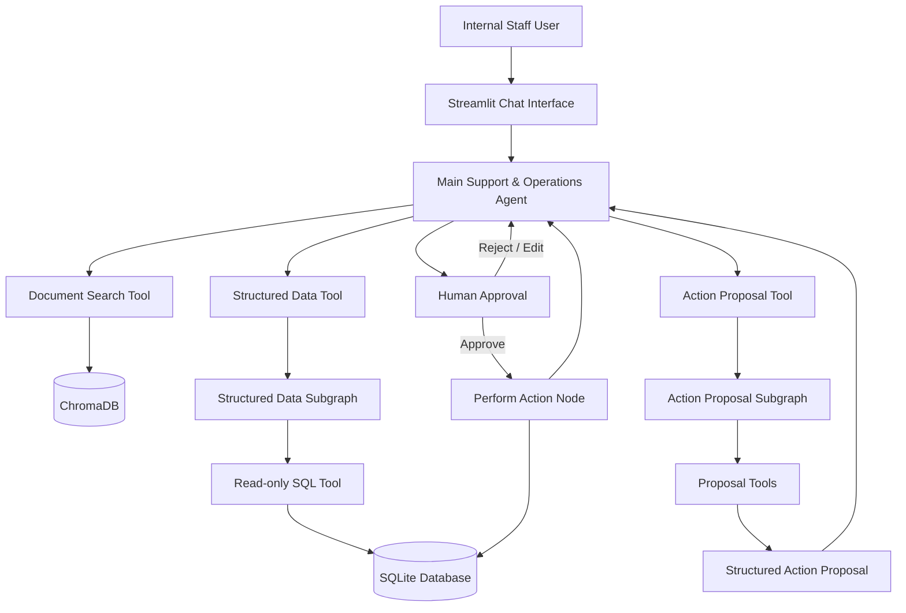
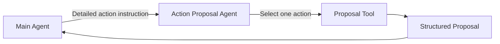
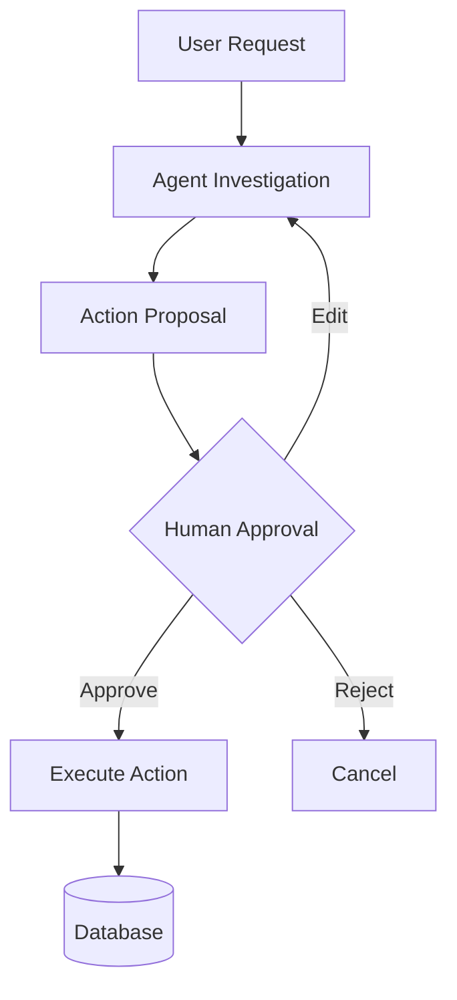

# ParcelPilot Internal Support & Operations AI Agent

An internal AI support system for ParcelPilot that helps authorised support and operations staff investigate customer issues, retrieve operational data, interpret policies and customer agreements, and propose operational actions with human approval before execution.

The system is built using **LangGraph**, **LangChain**, **OpenAI models**, **SQLite**, **ChromaDB**, and **Streamlit**.

---

## 1. Overview

ParcelPilot is a B2B logistics platform used by businesses to book and manage shipments across multiple carrier partners.

Its customer operations team regularly handles questions involving:

- Customer-specific contract terms
- Shipment cancellations
- Service credits
- Support SLAs
- Operational incidents
- Account information
- Order state
- Support tickets
- Follow-up work

Resolving these requests often requires combining information from multiple sources:

- Structured operational data
- Internal policies and SOPs
- Customer-specific agreements
- Product documentation
- Historical support tickets

The goal of this project is to provide an internal AI assistant that can investigate these issues reliably while respecting:

- Data authority
- Access control
- Human approval for state-changing actions
- Source reliability
- Multi-step reasoning

---


## 2. What the System Can Do

The agent supports three major capability groups.

### Document Retrieval

The agent can search ParcelPilot documentation for:

- Policies
- SOPs
- Customer agreements
- Product documentation
- Cancellation rules
- Service credit rules
- Support SLAs

Documents are indexed in ChromaDB and retrieved using semantic search.

The system deliberately distinguishes between different document authority levels:

1. Customer-specific agreements can override general policies.
2. Current policies and SOPs override deprecated documents.
3. Historical ticket resolutions are treated as context only and may contain incorrect guidance.


### Structured Operational Data

The agent can query ParcelPilot's SQLite operational database.

Available data includes:

- Accounts
- Orders
- Tickets
- Staff
- Follow-up tasks

The structured-data system supports:

- Record lookup
- Filtering
- Joins
- Aggregation
- Counts
- Totals
- Averages
- Time-based queries
- Relationship traversal

For example, the agent can investigate:

> "Review Northstar Logistics' open support issues."

This may involve multiple steps:

1. Retrieve the Northstar account.
2. Retrieve its open tickets.
3. Inspect related orders.
4. Inspect existing follow-up tasks.
5. Retrieve relevant policies or customer agreements.
6. Combine all evidence.
7. Recommend an operational action if necessary.


### Operational Actions

The system can propose actions affecting:

#### Follow-up tasks

- Create
- Update
- Delete


#### Tickets

- Create
- Update
- Delete


#### Orders

- Create
- Update
- Delete


#### Staff

- Create
- Update
- Delete

State-changing operations are never executed directly from an LLM tool call.

Instead, the system uses a **proposal → approval → execution** workflow.

---


## 3. Architecture

The system is divided into specialised LangGraph components.




---


## 4. Why the System Uses Multiple Agents

A deliberate design decision was made to avoid building one large agent responsible for everything.

The system separates responsibilities into specialised components.

### Main Agent

The main agent acts as the orchestrator.

Its responsibilities are:

- Understand the user's request
- Decide what information is required
- Call the appropriate retrieval tools
- Perform multi-step investigations
- Compare structured data with policies and agreements
- Identify operational issues
- Decide whether an action should be proposed
- Present findings to the human operator
- Request approval before state-changing actions

The main agent does not need to know SQL or detailed action schemas.

### Structured Data Subgraph

The structured-data subgraph is a retrieval specialist.

Its responsibility is to convert a natural-language data request into one or more safe, read-only SQL queries.

The main agent may ask:

> "Find Northstar Logistics' open tickets."

The structured-data agent decides how to retrieve that information from the database.

It can perform multiple SQL calls if the investigation requires sequential retrieval.

```text
Find account
    ↓
Get account_id
    ↓
Find open tickets
    ↓
Get ticket IDs
    ↓
Find related tasks
```

This separation prevents the main agent from needing to understand database schemas or SQL.

### Action Proposal Subgraph

Action creation is also separated from the main agent.

The main agent only decides that an operational action should be proposed.

It then calls:

```text
propose_action
```

with a detailed instruction.

The action proposal subgraph:

1. Interprets the requested action.
2. Selects exactly one supported proposal tool.
3. Populates its required arguments.
4. Produces a structured action proposal.
5. Returns it to the main graph.

The proposal subgraph cannot modify the database.

---


## 5. Action Proposal Architecture

Instead of exposing every mutation tool directly to the main agent, the main agent only sees:

```text
search_docs
query_structured_data
propose_action
```

The `propose_action` tool internally delegates to the Action Proposal Subgraph.




Example proposal:

```json
{
  "action": "create_follow_up_task",
  "proposal": {
    "title": "Verify SwiftShip pickup for ORD-1001 / TKT-504",
    "description": "Verify whether physical pickup occurred and reconcile the order state.",
    "priority": "HIGH",
    "assigned_team": "Operations Support",
    "ticket_id": "TKT-504",
    "order_id": "ORD-1001"
  }
}
```

No database change has occurred at this stage.

---


## 6. Human-in-the-Loop Actions

All state-changing operations require explicit human confirmation.

The workflow is:




Example conversation:

```text
User:
Check TKT-504 and determine what needs to be done.

Agent:
The ticket reports a pickup, but ORD-1001 still shows BOOKED.

I propose creating a HIGH-priority Operations Support task to verify
the pickup and reconcile the order state.

Would you like me to proceed?

User:
Yes.

System:
Follow-up task created: 3
```

This satisfies the requirement that every mutation requires explicit confirmation.

---


## 7. Access Control

The chatbot is designed for internal ParcelPilot staff.

Authentication is mocked through the Streamlit interface.

Each staff member has:

- `user_id`
- `name`
- `role`

Example roles:

```text
SUPPORT
OPERATIONS
ADMIN
```


### Role-Based Access Control

Permissions are enforced in the tool/data layer rather than relying on prompts.

Example permissions include:

```text
READ_DOCUMENTS
READ_OPERATIONAL_DATA
WRITE_OPERATIONAL_DATA
MANAGE_FOLLOW_UP_TASKS
MANAGE_STAFF
```

Example role mapping:

```python
ROLE_PERMISSIONS = {
    Role.SUPPORT: {
        Permission.READ_DOCUMENTS,
        Permission.READ_OPERATIONAL_DATA,
    },

    Role.OPERATIONS: {
        Permission.READ_DOCUMENTS,
        Permission.READ_OPERATIONAL_DATA,
        Permission.WRITE_OPERATIONAL_DATA,
        Permission.MANAGE_FOLLOW_UP_TASKS,
    },

    Role.ADMIN: {
        Permission.READ_DOCUMENTS,
        Permission.READ_OPERATIONAL_DATA,
        Permission.WRITE_OPERATIONAL_DATA,
        Permission.MANAGE_FOLLOW_UP_TASKS,
        Permission.MANAGE_STAFF,
    },
}
```

Every protected tool retrieves the user's role from LangGraph runtime state:

```python
role = runtime.state.get("role")

require_permission(
    role,
    Permission.READ_OPERATIONAL_DATA,
)
```

This means an LLM cannot bypass authorization by generating different arguments.

### Table-Level Authorization

Structured-data access also considers which database tables are being queried.

For example:

- Operational records may require `READ_OPERATIONAL_DATA`.
- Staff data requires staff-management access.

This prevents an authorised operations user from automatically gaining access to privileged staff-management data merely because both are stored in the same database.

---


## 8. Authentication Context

The Streamlit application injects authenticated user information directly into the LangGraph state.

```python
input_state = {
    "messages": [
        HumanMessage(content=user_input)
    ],
    "user_id": user["user_id"],
    "role": user["role"],
}
```

The LLM never supplies or controls these fields.

Subgraphs receive this identity context through `ToolRuntime`.

This ensures authorization decisions are based on application-controlled state rather than model-generated values.

---


## 9. Multi-Step Reasoning

A major design requirement was avoiding one giant tool call.

Both the main agent and structured-data agent are instructed to work iteratively.

For example:

```text
User:
Review Northstar's operational issues.
```

The agent may perform:

```text
1. Query Northstar account
2. Inspect open tickets
3. Inspect relevant orders
4. Inspect related follow-up tasks
5. Search applicable support policy
6. Search Northstar's agreement
7. Compare operational evidence with policy
8. Identify an unresolved issue
9. Propose an operational action
```

Each tool call has a focused objective.

This improves:

- Reliability
- Debuggability
- Tool selection
- SQL quality
- Context management

---


## 10. Source Authority

The supplied source pack intentionally contains imperfect information.

The system therefore uses an explicit authority hierarchy.

### Customer-Specific Agreements

Highest authority for customer-specific contractual terms.

```text
Northstar Agreement
        ↓ overrides
General Cancellation Policy
```


### Current Policies and SOPs

Authoritative for general operational rules.

### Deprecated Policies

Historical only.

They must not override current policies.

### Historical Ticket Resolutions

Historical context only.

They may contain incorrect guidance and are never considered authoritative policy.

### Structured Operational Data

The source of truth for current operational state.

For example:

```text
Current order status
Current ticket status
Current staff assignment
Current task status
```

are taken from the database rather than documents or historical conversations.

---


## 11. Database Safety

The structured-data agent can only execute read-only SQL.

Allowed queries:

```sql
SELECT ...
WITH ... SELECT ...
```

Disallowed operations include:

```text
INSERT
UPDATE
DELETE
DROP
ALTER
CREATE
ATTACH
DETACH
PRAGMA
```

All database mutations are implemented as explicit Python functions outside the SQL agent.

This prevents the model from generating arbitrary database modifications.

---


## 12. Action Execution Safety

Proposal tools and execution functions are intentionally separated.

A proposal tool does not modify the database.

It returns:

```json
{
  "action": "create_follow_up_task",
  "proposal": {
    "...": "..."
  }
}
```

Only after human confirmation does the main graph reach:

```text
perform_action
```

which calls deterministic database functions such as:

```python
create_task_in_database(...)
update_task_in_database(...)
create_ticket_in_database(...)
update_order_in_database(...)
```

This architecture keeps LLM reasoning separate from database mutation.

---


## 13. Application State

The main LangGraph state tracks information such as:

```text
messages
user_id
role
pending_action
execution_result
```

`pending_action` represents an action waiting for human confirmation.

`execution_result` represents the authoritative result of an executed action.

Separating execution results from conversational messages prevents the LLM from confusing:

```text
Proposed action
```

with:

```text
Action successfully executed
```

---


## 14. Streamlit Interface

The application exposes the system through a simple internal chat UI.

The interface provides:

- Staff user selection
- Role display
- Conversation history
- New conversation/thread creation
- Tool-call visibility
- Tool-output visibility
- Human approval interaction
- LangGraph checkpointed conversations
- Debugging information

Tool calls and outputs are displayed in expandable sections, which makes it easier to inspect the agent workflow during development and evaluation.

---


## 15. Example Workflow

Consider:

> "Review Northstar Logistics' current support issues."

The system may perform:

```text
Main Agent
    ↓
query_structured_data
    ↓
Northstar account
    ↓
query_structured_data
    ↓
Open tickets
    ↓
query_structured_data
    ↓
Relevant orders
    ↓
query_structured_data
    ↓
Existing follow-up tasks
    ↓
search_docs
    ↓
Support policy
    ↓
search_docs
    ↓
Northstar agreement
    ↓
Main Agent reasoning
    ↓
Identify conflicting pickup evidence
    ↓
propose_action
    ↓
create_follow_up_task proposal
    ↓
Human approval
    ↓
perform_action
    ↓
SQLite
```

This demonstrates a multi-source, multi-tool investigation rather than a simple RAG chatbot.

---


## 16. Technical Decisions


### Why LangGraph?

The application requires:

- Multiple tools
- Subgraphs
- Multi-step reasoning
- Persistent state
- Human interruption
- Approval/resume workflows
- Controlled routing

LangGraph provides explicit control over these workflows and makes the agent state machine inspectable.

### Why Separate Subgraphs?

Two responsibilities were complex enough to isolate:

#### Structured Data

Natural language → safe SQL retrieval

#### Action Proposal

Operational intent → validated structured action

This reduces prompt complexity and improves maintainability.

### Why SQLite?

SQLite is sufficient for the assignment dataset and provides:

- Real relational queries
- Foreign keys
- Joins
- Persistent state
- Low setup overhead

The architecture could later replace SQLite with PostgreSQL without changing the high-level agent design.

### Why ChromaDB?

The supplied document set requires semantic retrieval rather than exact-key lookup.

ChromaDB provides lightweight local vector storage suitable for the assignment.

### Why Streamlit?

Streamlit provides a fast way to expose:

- Chat interactions
- User simulation
- Tool debugging
- Human approval
- Conversation state

without building a separate frontend/backend application.

---


## 17. Project Structure

A simplified project structure:

```text
backend/
│
├── app.py
├── requirements.txt
├── pyproject.toml
│
├── auth/
│   └── ...
│
├── data/
│   ├── database.py
│   └── ...
│
└── graphs/
    ├── main_graph/
    │   ├── graph.py
    │   ├── nodes.py
    │   ├── prompts.py
    │   ├── states.py
    │   ├── tools.py
    │   └── utils.py
    │
    ├── structured_data/
    │   ├── graph.py
    │   ├── nodes.py
    │   ├── prompts.py
    │   ├── states.py
    │   └── tools.py
    │
    └── action_proposal/
        ├── graph.py
        ├── nodes.py
        ├── prompts.py
        ├── states.py
        └── tools.py
```

The exact repository layout may differ slightly depending on how the project is packaged.

---


## 18. Running the Project


### Install dependencies

Using `uv`:

```bash
uv sync
```

Or from an exported requirements file:

```bash
pip install -r requirements.txt
```


### Environment variables

Create a `.env` file:

```env
OPENAI_API_KEY=your_openai_api_key
```

Add any other environment variables required by the application.

### Run the Streamlit application

```bash
streamlit run app.py
```

The default Streamlit server is normally available at:

```text
http://localhost:8501
```


### Docker

The image is Python 3.14.5. Local ChromaDB (`data/chroma/`) and SQLite (`data/parcel_pilot.db`) are **not** copied into the image, so initialize the database and embeddings inside the container before using the UI.

Build from the `backend/` directory (where the `Dockerfile` lives):

```bash
docker build -t parcelpilot .
```

To initialize data and run the app, start an interactive shell (override the default Streamlit command):

```bash
docker run -it -p 8501:8501 --env-file .env parcelpilot /bin/bash
```

Inside the container:

```bash
python main.py
streamlit run app.py --server.address=0.0.0.0 --server.port=8501
```

`--env-file .env` is required because secrets are not baked into the image. `--server.address=0.0.0.0` is required so the UI is reachable from the host.

Open:

```text
http://localhost:8501
```

The default image command starts Streamlit only (no init). Use that after data already exists in the container, or if you mount initialized volumes:

```bash
docker run -p 8501:8501 --env-file .env parcelpilot
```

To inspect a running container from another terminal:

```bash
docker exec -it <container_id_or_name> /bin/bash
```

---


## 19. Assignment Requirements Coverage


| Requirement                       | Implementation                                           |
| --------------------------------- | -------------------------------------------------------- |
| Natural-language chatbot          | Main LangGraph Support & Operations Agent                |
| Supplied data as information base | SQLite + indexed supplied documents                      |
| Source authority handling         | Customer agreement > current policy > deprecated/history |
| Access control                    | Tool/data-layer RBAC                                     |
| Mock authentication               | Streamlit staff selection                                |
| Document retrieval tool           | `search_docs`                                            |
| Structured-data tool              | `query_structured_data`                                  |
| State-changing action             | `propose_action` + `perform_action`                      |
| Human confirmation                | Explicit approval before execution                       |
| Multi-step requests               | Iterative agent + subgraph tool loops                    |
| Interface                         | Streamlit chat application                               |
| Tool visibility                   | Tool calls and outputs shown in UI                       |


---


## 20. Key Design Principles


### Retrieval before reasoning

The agent retrieves ParcelPilot-specific facts rather than guessing.

### Evidence before action

Actions are proposed only after the relevant operational state has been investigated.

### One action per proposal

Each proposal represents one concrete state-changing operation.

### Human approval before mutation

LLM-generated proposals cannot directly modify application state.

### Authorization outside the LLM

Permissions are enforced by Python/tool logic rather than model instructions.

### Structured data for current state

The database is authoritative for operational facts.

### Documents for policy

Policies and agreements determine rules and contractual terms.

### Explicit source hierarchy

Not every retrieved document is treated as equally reliable.

### Specialised agents over one monolithic agent

The main agent orchestrates specialised subgraphs instead of handling SQL, schemas, policies, actions, and execution itself.

---


## 21. Limitations and Future Improvements

This implementation intentionally focuses on the assignment scope.

Potential improvements include:

- Real authentication instead of mocked staff selection
- Account-level and record-level authorization
- PostgreSQL instead of SQLite
- Dedicated domain actions such as `cancel_order`, `close_ticket`, or `escalate_ticket`
- Explicit SLA monitoring
- Customer notification tools
- Audit logs for approved mutations
- Stronger business-rule validation before mutations
- Integration with real support systems
- Production observability and tracing
- Automated evaluation suites for policy and tool-use correctness
- Hosted deployment

---


## Conclusion

This project is designed as more than a simple RAG chatbot.

It combines:

- Document retrieval
- Structured operational data
- Multi-step agent reasoning
- Role-based authorization
- Source reliability handling
- Specialised LangGraph subgraphs
- Structured action proposals
- Human-in-the-loop approval
- Deterministic database mutations
- An inspectable Streamlit interface

The main architectural goal was to keep **retrieval, reasoning, authorization, proposal generation, human approval, and execution as separate responsibilities**.

This makes the system safer, easier to debug, and more representative of how an internal AI operations assistant could be integrated into a real support workflow.